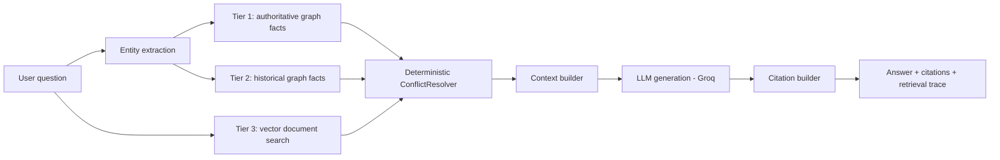

# Deterministic GraphRAG Knowledge Assistant

A production-style conversational Graph-RAG API built on a **deterministic
3-tier retrieval architecture**: authoritative graph facts, historical graph
facts, and unstructured vector document search — with conflicts resolved by
explicit rules, not by asking an LLM to arbitrate.

## Why plain vector RAG is insufficient

Plain vector-similarity RAG treats every retrieved chunk as equally
trustworthy and has no notion of *authority* or *time*. Ask "who is
Microsoft's CEO" and it might retrieve a 2005 blog post about Steve Ballmer
and a 2024 press release about Satya Nadella with similar cosine scores, then
leave it to the LLM to guess which is current — a non-deterministic,
unauditable decision. This system instead treats structured facts as
first-class, ranks sources by explicit authority tiers, and answers temporal
questions ("CEO in 2010" vs "CEO now") correctly using validity windows,
independent of embedding similarity.

## Architecture



### 3-tier model

| Tier | Source | Priority | Example |
|------|--------|----------|---------|
| 1 | Authoritative graph facts (curated/verified) | 100 | "Microsoft CEO = Satya Nadella" |
| 2 | Historical/statistical graph facts | 50 | "Microsoft CEO = Steve Ballmer (2000-2014)" |
| 3 | Unstructured vector document search (Qdrant) | 10 | A chunk from an uploaded PDF mentioning Ballmer |

Tier 1 overrides Tier 2 overrides Tier 3 **on genuine conflicts** — but facts
with distinct, non-overlapping temporal validity windows are never collapsed;
they're preserved so "who was CEO in 2010" and "who is CEO now" can both be
answered correctly from the same fact store. See `app/rag/conflict_resolver.py`.

### Conflict resolution rules (deterministic, not LLM-routed)

1. Higher priority wins (tier1 > tier2 > tier3).
2. Tie on priority → higher confidence wins.
3. Tie on confidence → newer `valid_from` wins.
4. Facts with distinct temporal windows are preserved side-by-side, never
   silently merged.
5. Every resolution is recorded (`ConflictRecord`) and surfaced in the
   `retrieval_events` table and API response for auditability.

### Ingestion pipeline

Upload (`POST /api/v1/documents/upload`) validates type/size/filename, stores
the file, writes a `documents` row + `ingestion_jobs` row, and returns
immediately — processing always happens asynchronously via Celery
(`app/workers/tasks.py`): extract text → chunk → embed → upsert to Qdrant →
extract entities/relationships (spaCy) → store low-confidence graph facts →
update job/document status (`PENDING → PROCESSING → COMPLETED|FAILED`).
Duplicate uploads are detected via SHA-256 content hash.

## API surface (`/api/v1`)

- `POST /auth/register`, `POST /auth/login`, `GET /auth/me`
- `POST /documents/upload`, `GET /documents`, `GET /documents/{id}`,
  `DELETE /documents/{id}`, `GET /documents/{id}/status`
- `POST /chat`, `POST /chat/stream` (SSE)
- `POST /conversations`, `GET /conversations`
- `GET /health/live`, `GET /health/ready`, `GET /health`
- `GET /metrics` (Prometheus, root-level, not versioned)

`POST /chat` response shape:
```json
{
  "answer": "...",
  "conversation_id": "...",
  "citations": [{"source_type": "graph", "tier": 1, "subject": "Microsoft", "predicate": "ceo", "object": "Satya Nadella"}],
  "retrieval": {"tier_1": [...], "tier_2": [...], "tier_3": [...]},
  "metadata": {"latency_ms": 812, "model": "llama-3.3-70b-versatile"}
}
```

Every route enforces ownership via `get_current_user()`; user id is **never**
trusted from the request body, only from the verified JWT.

## Local setup (no Docker)

```bash
make setup                 # creates .venv, installs deps, downloads spaCy model
cp .env.example .env       # fill in GROQ_API_KEY (free tier) if you want real answers
make test                  # runs the full suite against sqlite + fakes, no live infra needed
uvicorn app.main:app --reload
```

## Docker

```bash
make up      # docker compose up --build: api, worker, postgres, redis, qdrant, nginx, prometheus, grafana
make migrate # alembic upgrade head
make seed    # loads the demo tech-company knowledge graph
make down
```

Only `nginx` (8080), `prometheus` (9090), and `grafana` (3001) are published
to the host. Postgres, Redis, and Qdrant are internal-network-only.

## Environment variables

See `.env.example`. Highlights: `LLM_MODEL` (Groq model name, fully
configurable, never hardcoded), `EMBEDDING_MODEL`, `DATABASE_URL`,
`REDIS_URL`, `QDRANT_URL`, `JWT_SECRET`, `RATE_LIMIT_PER_MINUTE`,
`MAX_UPLOAD_SIZE_MB`.

## Testing

`pytest` with `unit/`, `integration/`, `e2e/` splits. No Postgres, Redis,
Qdrant, or Docker required — tests run against sqlite (aiosqlite),
an in-memory `NetworkXGraphRepository`, a `FakeVectorRepository`,
`FakeEmbeddingProvider`, and `FakeLLMProvider` (Groq is never called in
tests). Coverage includes: tier1 > tier2 > tier3 conflict resolution,
temporal correctness (historical facts don't leak into "current" answers),
cross-user data isolation (vector search, document access, conversation
access), auth/authz, document upload + ownership, ingestion failure
handling, citation generation, response caching, and rate limiting.

```bash
make test
```

## Observability

- **Tracing**: OpenTelemetry FastAPI instrumentation (hook point in `app/main.py`).
- **Metrics** at `/metrics`: `rag_requests_total`, `rag_request_latency_seconds`,
  `rag_llm_latency_seconds`, `rag_vector_search_latency_seconds`,
  `rag_graph_search_latency_seconds`, `rag_cache_hits_total`,
  `rag_cache_misses_total`, `document_ingestion_total`,
  `document_ingestion_failures_total`.
- **Logging**: structured JSON via `structlog`, every request tagged with a
  `request_id` (propagated via `X-Request-ID`); passwords/JWTs/API
  keys/full document bodies are never logged (`app/observability/logging.py`
  redacts known secret keys).
- **Dashboards**: `grafana/dashboards/graphrag-overview.json` — req/sec,
  p95/p99 latency, error rate, LLM/vector/graph latency, cache hit rate,
  ingestion success/failure, retrieval tier usage.
- **Errors**: centralized `AppError` hierarchy → consistent
  `{"error": {"code", "message", "request_id"}}` JSON, no stack traces leaked.

## Security

- Passwords hashed with bcrypt (passlib); JWT auth on every protected route.
- Every document/conversation route checks resource ownership server-side.
- Vector search is filtered by `user_id` at the Qdrant query level — no
  cross-user leakage even if document IDs are guessed.
- Upload validation: content-type allowlist (PDF/TXT/DOCX), size cap,
  filename sanitization + path-traversal protection.
- Redis-backed per-user rate limiting (`RATE_LIMIT_PER_MINUTE`, default 20/min).
- Retrieved document text is treated as **untrusted data**, not instructions,
  in the generation prompt, with a best-effort heuristic prompt-injection
  flagger (`app/rag/prompt_injection.py`).

## Limitations (read this before trusting outputs)

- **Not hallucination-free.** The system constrains the LLM to supplied
  evidence via prompting, but nothing prevents an LLM from ignoring
  instructions or paraphrasing inaccurately. Treat answers as assisted, not
  guaranteed correct.
- **Prompt-injection defense is best-effort only.** The heuristic detector
  matches known phrasings; it will miss novel injection techniques and can
  false-positive on benign text. It is a signal, not a guarantee.
- **spaCy NER is not perfect**, especially the blank-pipeline fallback used
  when `en_core_web_sm` isn't installed (degrades to no entity extraction
  rather than crashing). Relationship extraction from raw text is a
  deliberately conservative heuristic (precision over recall) and is a
  secondary signal — curated tier1/tier2 facts remain the source of truth.
- **The local embedding model** (`sentence-transformers/all-MiniLM-L6-v2` by
  default) is small and fast but has limited semantic accuracy versus larger
  hosted embedding models.
- **The in-memory graph store** (`NetworkXGraphRepository`) does not persist
  across process restarts and is not horizontally scalable; it's designed
  behind an abstract `GraphRepository` so a Neo4j-backed implementation can
  be substituted without touching service/API code.
- **Question rewriting for multi-turn context** is intentionally simple
  (history is loaded but not yet used to rewrite follow-up questions into
  standalone form) — flagged as a clear extension point.

## Future improvements

- Neo4j-backed `GraphRepository` implementation for real graph scale/queries.
- LLM-assisted question rewriting for multi-turn conversational context.
- Token-level streaming from the LLM provider (currently the full answer is
  generated, then streamed word-by-word over SSE).
- Richer entity resolution/deduplication (e.g. "Microsoft" vs "MSFT").
- Structured LLM-based extraction as a secondary, higher-recall complement to
  spaCy NER, gated behind human/automated review before promotion to tier1/2.
